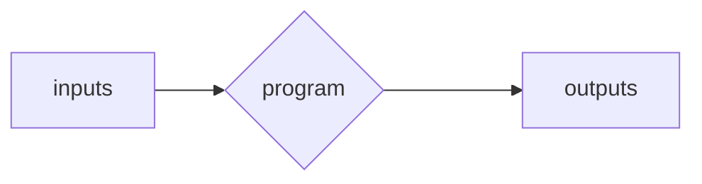
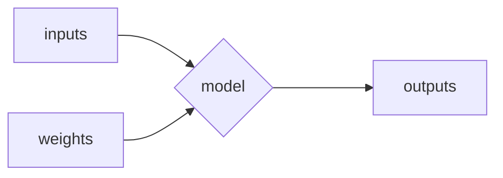
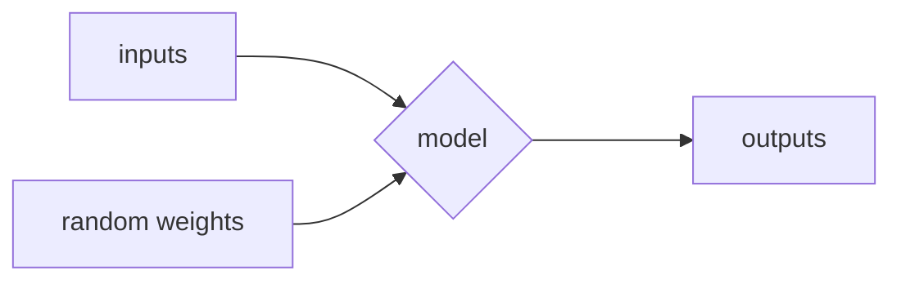
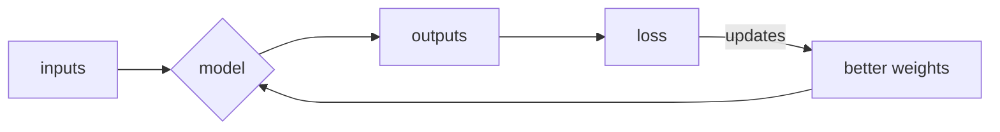
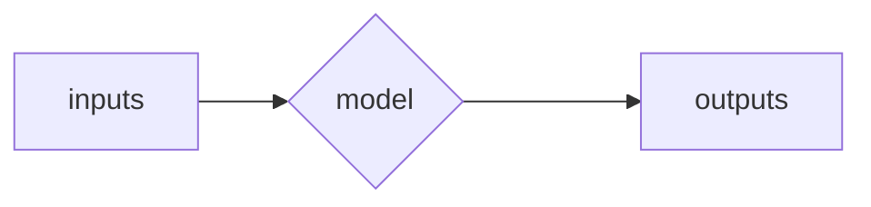

# Classic ML vs Deep Learning
To explain, let's look at a problem: we want an ML model that looks at images of breast cancer and determines the survivability of the patient.

## Classic ML
1. Pool together experts in ML and breast cancer
2. In each image, the experts in breast cancer will identify what aspects of an image of breast cancer affect survivorship
3. The ML team then codes that into the model. These concepts that the model is learning are called "features"

- this approach is slower since humans need to do the identification manually

## Deep Learning

- this approach does not require us to identify the aspects of the images that affect survivorship
- the neural network identifies then builds the "features" for us

1. start off with a random neural network
2. feed it examples so it can learn to recognize patterns 
3. it creates features for itself (it learns on its own)

- the reason deep learning is so much faster is because we do not have to hand-code the features we need
- we just let the neural network build the features for us

# Image Recognizer
- can be used for other things aside from recognizing images
  - requires creativity

- can also be used for classifying sounds
  - this can be done by converting wave forms (sound) into images

- can also be used for classifying mouse movements
  - this can be done by converting the mouse movements into images
  - movements can be lines and clicks can be circles

- to train an image recognizer model, you don't need big images
- small images are enough to train the model
- moreover, big images take time to load into the RAM so there's no need for big images
- that's why resizing them makes a lot of sense before feeding them into the model

# Fast AI
- python package used for creating ml models
- library built on top of pytorch

# More examples of Deep Learning

### Image Segmentation
- Given an image, the model needs to identify which segment each pixel belongs to
- Ex: Given an image of a road from the POV of a driver, segment the image into cars, roads, buildings, trees, and the sky

### Tablular analysis
- Given a spreadsheet/table, predict what will happen given the columns
- Used in income prediction

### Collaborative filering
- Used in recommendation systems
- What is it:
  - given that Group A likes Product A
  - given that Group B likes Product B
  - if Group A and Group B are similar, recommend Product B to Group A
  - this is not about demographic similarity. It is about similarity in terms of liking the same kinds of products
- Example:
  - When you first open Netflix, it asks you for what you like to watch
  - You put Demon Slayer and Chainsaw Man
  - Many people who like these shows may like Hell's Paradise as well
  - Hence, you get recommended Hell's Paradise

# How are models different from classic programs?
Program

- program takes inputs
- program has loops, variables, conditionals, etc.
- program has outputs

Model

- model takes inputs and weights
- model is a mathematical function that operates on the inputs and weights
- model has outputs

# How is a model trained?
1. The model will not work properly unless the weights for the model are chosen properly. Hence, we iteratively make the weights better. However, at first, we make those weights random.

2. We train our model. Based on the outputs, we get the loss. Loss determines how effective the model was. In image recognition, an effective model would be being able to classify images correctly. If the model is ineffective then we update the weights to be better such that the loss would be better. We do this iteratively until the model becomes good.

  - There are a few reasons why this is hard:
    - how do you make the weights "better" in each iteration?
    - can the model be flexible enough to solve your problem? The answer is yes. The mathematical function used in a model is flexible enough to solve any computable function (e.g. generating artworks, translate english to german)

3. Once the model is trained, it looks a lot like a normal program. Once the weights have been turned "good," they can just be incorporated into the model.

- Since a trained model takes inputs and has outputs like a program, a model can be used in any arbitrary code. However, deployment is still trickier than with classic programs.